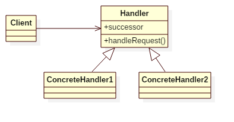

## Intent
The chain of responsibility pattern decouples the sender of a request from its receiver,
by giving more than one object an opportunity to handle the request.
The request is processed by the chain until some object handles it.

## Applicability
Use Chain of Responsibility when

* more than one object may handle a request, and the handler isn't known a priori. The handler should be ascertained automatically
* you want to issue a request to one of several objects without specifying the receiver explicitly
* the set of objects that can handle a request should be specified dynamically

## Structure

## Participants
* Handler: a handler object has a successor, if it can not handle the request, it pass the request to its successor.
* Client: a client object does not know anything about the handlers are in the chain, it just send the requests to the chain.

## Example
In this example, it demonstrates a software company handles customer's requests.

The customer(App) is the Client. The SoftwareCommpany, as the interface who response to customers' requests, constructs
a chain of responsibility -- different roles handling different requests: developer can handle bugs, architect can handle
features and CTO can handle products -- customers don't need to know whom should the request send to, they just send
requests to the SoftwareCompany, in this way, it decouples the sender of a request from its receiver.
