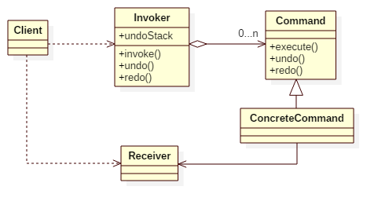

# Command Pattern

## Also known as
Action, Transaction

## Intent
Encapsulate a request as an object, thereby letting you
parameterize clients with different requests, queue or log requests, and
support undoable operations.

## Applicability
Use the Command pattern when you want to

* parameterize objects by an action to perform. You can express such parameterization in a procedural language with a callback function, that is, a function that's registered somewhere to be called at a later point. Commands are an object-oriented replacement for callbacks.
* specify, queue, and execute requests at different times. A Command object can have a lifetime independent of the original request. If the receiver of a request can be represented in an address space-independent way, then you can transfer a command object for the request to a different process and fulfill the request there
* support undo. The Command's execute operation can store state for reversing its effects in the command itself. The Command interface must have an added Unexecute operation that reverses the effects of a previous call to execute. Executed commands are stored in a history list. Unlimited-level undo and redo is achieved by traversing this list backwards and forwards calling unexecute and execute, respectively
* support logging changes so that they can be reapplied in case of a system crash. By augmenting the Command interface with load and store operations, you can keep a persistent log of changes. Recovering from a crash involves reloading logged commands from disk and re-executing them with the execute operation
* structure a system around high-level operations build on primitive operations. Such a structure is common in information systems that support transactions. A transaction encapsulates a set of changes to data. The Command pattern offers a way to model transactions. Commands have a common interface, letting you invoke all transactions the same way. The pattern also makes it easy to extend the system with new transactions

## Structure

## Participants
* **Command**
    - declares an interface for executing an operation.
* **ConcreteCommand**
    - a concrete command object knows about the receiver and invokes a method or changes a state of the receiver. Values for parameters of the receiver method are stored in the command.
* **Receiver**
    - a receiver object is the entity who does the work.
* **Invoker**
    - an invoker object knows how to execute a command, and optionally does bookkeeping about the command execution. The invoker does not know anything about a concrete command, it knows only about command interface.
* **Client**
    - an client object holds an invoker object and several command objects. The client decides which commands to execute at which points. To execute a command, it passes the command object to the invoker object. The client does not operate with receiver directly. The invocation chain is like: client => invoker => command => receiver.

## Example
In this example, it demonstrates a man operates TV by remote controller.

The man(App) is the client. He uses RemoteController(invoker) to ask Television(receiver) execute some Commands.
The RemoteController keeps track of commands, so it is easy to undo/redo them.

Participants in this example:
* App is the **Client**.
* RemoteController is the **Invoker**.
* Television is the **Receiver**.
* Command is the **Command**.
* SetChannelCommand/SetVolumeCommand is the **ConcreteCommand**.

## Scala Tips
* Actually, each command is a function, so we can implement this pattern in functional programming style.

## Reference
* Design Patterns: Elements of Reusable Object-Oriented Software