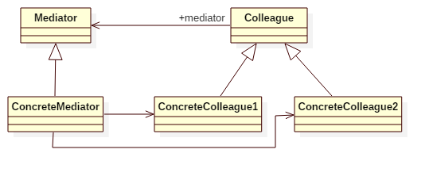

# Mediator Pattern

## Intent
Define an object that encapsulates how a set of objects interact.Mediator promotes
loose coupling by keeping objects from referring toeach other explicitly, and
it lets you vary their interaction independently.

## Applicability
Use the Mediator pattern when
* a set of objects communicate in well-defined but complex ways. The resulting interdependencies are unstructured and difficult to understand.
* reusing an object is difficult because it refers to and communicates with many other objects.
* a behavior that's distributed between several classes should be customizable without a lot of subclassing.

## Structure

## Participants
* **Mediator**
    - defines an interface for communicating with Colleague objects.
* **ConcreteMediator**
    - implements cooperative behavior by coordinating Colleague objects.
    - knows and maintains its colleagues.
* **Colleague** (optional)
    - defines an interface for services provided by colleagues objects.
* **ConcreteColleague**
    - each Colleague class knows its Mediator object.
    - each colleague communicates with its mediator whenever it would have otherwise communicated with another colleague.

## Example
Countries joined in the United Nations can declare and receive messages. The United Nations works as a mediator
which implements the cooperative behavior by routing messages between the appropriate countries.

Participants in this example:
* Organization is the **Mediator**.
* UnitedNations is the **ConcreteMediator**.
* Country is the **Colleague**.
* Canada/China/USA are the **ConcreteColleague** classes.

## Scala Tips
N/A

## Reference
* Design Patterns: Elements of Reusable Object-Oriented Software