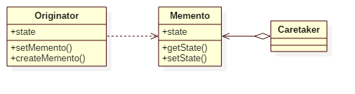

# Memento Pattern

## Intent
Without violating encapsulation, capture and externalize an object's internal
state so that the object can be restored to this state later.

## Applicability
Use the Memento pattern when
* a snapshot of (some portion of) an object's state must be saved so that it can be restored to that state later, and
* a direct interface to obtaining the state would expose implementation details and break the object's encapsulation.

## Structure

## Participants
* **Memento**
    - stores internal state of the Originator object.
    - protects against access by objects other than the originator.
* **Originator**
    - creates a memento containing a snapshot of its current internal state.
    - uses the memento to restore its internal state.
* **Caretaker**
    - is responsible for the memento's safekeeping.
    - never operates on or examines the contents of a memento.

## Example
A NotebookMemento is a snapshot of a Notebook. Notebook can restore its state and provide undo operation according to the NotebookMemento.

Participants in this example:
* Notebook is the **Originator**.
* NotebookMemento is the **Memento**, and NotebookMementoInternal is the **ConcreteMemento**.
* App is the **Caretaker**.

## Scala Tips
N/A

## Reference
* Design Patterns: Elements of Reusable Object-Oriented Software
