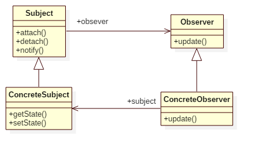

# Observer Pattern

## Intent
Define a one-to-many dependency between objects so that when one object changes
state, all its dependents are notified and updated automatically.

## Applicability
Use the Observer pattern in any of the following situations:
* When an abstraction has two aspects, one dependent on the other. Encapsulating these aspects in separate objects lets you vary and reuse them independently.
* When a change to one object requires changing others, and you don't know how many objects need to be changed.
* When an object should be able to notify other objects without making assumptions about who these objects are. In other words, you don't want these objects tightly coupled.

## Structure

## Participants
* **Subject**
    - knows its observers. Any number of Observer objects may observe a subject.
    - provides an interface for attaching and detaching Observer objects.
* **Observer**
    - defines an updating interface for objects that should be notified of changes in a subject.
* **ConcreteSubject**
    - stores state of interest to ConcreteObserver objects.
    - sends a notification to its observers when its state changes.
* **ConcreteObserver**
    - maintains a reference to a ConcreteSubject object.
    - stores state that should stay consistent with the subject's.
    - implements the Observer updating interface to keep its state consistent with the subject's.

## Example
Imagine the weather is changing, what will the boys and girls do?

Participants in this example:
* Weather is the **Subject / ConcreteSubject**.
* WeatherObserver is the **Observer**.
* Boy/Girl is the **ConcreteObserver**.

## Scala Tips
N/A

## Reference
* Design Patterns: Elements of Reusable Object-Oriented Software

