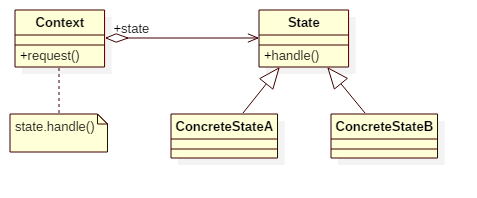

# State Pattern

## Intent
Allow an object to alter its behavior when its internal state changes.
The object will appear to change its class.

## Applicability
Use the State pattern in either of the following cases:
* An object's behavior depends on its state, and it must change its behaviorat run-time depending on that state.
* Operations have large, multipart conditional statements that depend on the
object's state. This state is usually represented by one or more enumerated
constants. Often, several operations will contain this same conditional
structure. The State pattern puts each branch of the conditional in a
separate class. This lets you treat the object's state as an object in its
own right that can vary independently from other objects.

## Structure

## Participants
* **Context**
    - defines the interface of interest to clients.
    - maintains an instance of a ConcreteState subclass that defines the current state.
* **State**
    - defines an interface for encapsulating the behavior associated with a particular state of the Context.
* **ConcreteState**
    - each subclass implements a behavior associated with a state ofthe

## Example
As you known, 'Caps Lock' button can change the behavior of keyboards. While it is turned on,
all output characters are in upper case. In the other side, while it is turned off, all output
characters are in lower case. Let's see how we model it!

Participants in this example:
* Keyboard is the **Context**.
* KeyboardState is the **State**.
* UpperCaseState/LowerCaseState is the **ConcreteState**.

## Scala Tips
N/A

## Reference
* Design Patterns: Elements of Reusable Object-Oriented Software

