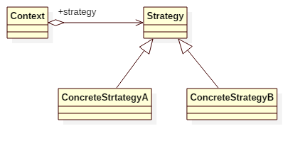

# Strategy Pattern

## Intent
Define a family of algorithms, encapsulate each one, and make them interchangeable.
Strategy lets the algorithm vary independently from clients that use it.

## Applicability
Use the Strategy pattern when
* many related classes differ only in their behavior. Strategies provide a way to configure a class with one of many behaviors.
* you need different variants of an algorithm.
* an algorithm uses data that clients shouldn't know about. Use the Strategy pattern to avoid exposing complex, algorithm-specific data structures.
* a class defines many behaviors, and these appear as multiple conditional
statements in its operations. Instead of many conditionals, move related
conditional branches into their ownStrategy class.

## Structure

## Participants
* **Strategy**
    - declares an interface common to all supported algorithms. Context uses this interface to call the algorithm defined by a ConcreteStrategy.
* **ConcreteStrategy**
    - implements the algorithm using the Strategy interface.
* **Context**
    - is configured with a ConcreteStrategy object.
    - maintains a reference to a Strategy object.
    - may define an interface that lets Strategy access its data.

## Example
This example demonstrates a Sorter that can sort an array of data and choose which specific sort algorithm (quick-sort or bubble-sort) is used.

Participants in this example:
* Sorter is the **Context**.
* SortStrategy is the **Strategy**.
* QuickSortStrategy/BubbleSortStrategy is the **ConcreteStrategy**.

## Scala Tips
* You can implement strategy in functional programming style.

## Reference
* Design Patterns: Elements of Reusable Object-Oriented Software

