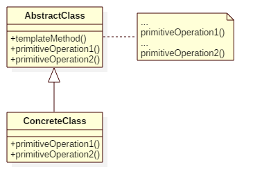

# Template Method Pattern

## Intent
Define the skeleton of an algorithm in an operation, deferring some steps to
subclasses. Template Method lets subclasses redefinecertain steps of an algorithm
without changing the algorithm's structure.

## Applicability
The Template Method pattern should be used
* to implement the invariant parts of an algorithm once and leave it up to subclasses to implement the behavior that can vary.
* when common behavior among subclasses should be factored and localized in a common class to avoid code duplication.
* to control subclasses extensions. You can define a template method that calls
"hook" operations at specific points,thereby permitting extensions only at those points.

## Structure

## Participants
* **AbstractClass**
    - defines abstract primitive operations that concrete subclasses define to implement steps of an algorithm.
    - implements a template method defining the skeleton of an algorithm.The template method calls primitive
    operations as well as operations defined in AbstractClass or those of other objects.
* **ConcreteClass**
    - implements the primitive operations to carry out subclass-specific steps of the algorithm.

## Example
Imagine a customer go to a restaurant, the common action of customers is ordering some food and then giving some comments.
We can create a template for customers' action pattern, and let specific customer determine what specific operation they want to do.

Participants in this example:
* Customer is the **AbstractClass**.
* Vegan/MeatLover is the **ConcreteClass**.

## Scala Tips
N/A

## Reference
* Design Patterns: Elements of Reusable Object-Oriented Software

