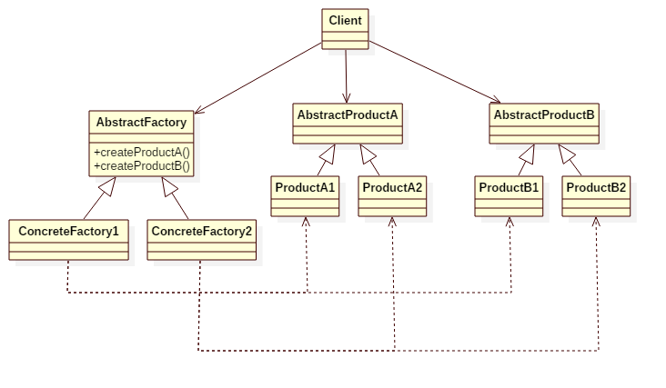

# Abstract Factory Pattern

## Intent
Provide an interface for creating families of related or dependent objects without specifying their concrete classes.

## Applicability
Use the Abstract Factory pattern when
* a system should be independent of how its products are created, composed, and represented.
* a system should be configured with one of multiple families of products.
* a family of related product objects is designed to be used together, and you need to enforce this constraint.
* you want to provide a class library of products, and you want to reveal just their interfaces, not their implementations.
* the lifetime of the dependency is conceptually shorter than the lifetime of the consumer.
* you need a run-time value to construct a particular dependency
* you want to decide which product to call from a family at runtime.
* you need to supply one or more parameters only known at run-time before you can resolve a dependency.

## Structure

## Participants
* **AbstractFactory**
    - declares an interface for operations that create abstract product objects.
* **ConcreteFactory**
    - implements the operations to create concrete product objects.
* **AbstractProduct**
    - declares an interface for a type of product object.
* **ConcreteProduct**
    - defines a product object to be created by the corresponding concrete factory.
    - implements the AbstractProduct interface.
* **Client**
    - uses only interfaces declared by AbstractFactory and AbstractProduct classes.

## Example
Consider you're making a car. Different car has different components.
Audi car needs AudiBrand, V6Engine and DunlopWheel, whereas BMW car needs BMWBrand, V8Engine and MichelinWheel.
Audi factory can create all components for Audi cars, while BMW factory can create all components for BMW cars.
To create an Audi car, just tell the Car object use the AudiFactory which will create a set of components for Audi.

Participants in this example:
* Engine, Wheel, Brand are the **AbstractProduct**.
* V6Engine/V8Engine, DunlopWheel/MichelinWheel, AudiBrand/BMWBrand are the **ConcreteProduct**.
* CarFactory is the **AbstractFactory**.
* AudiCarFactory, BMWCarFactory are the **ConcreteFactory**.
* Car is the **Client**.

## Scala Tips
* A concrete factory is often a singleton, you can use "object" to make it.

## Reference
* Design Patterns: Elements of Reusable Object-Oriented Software