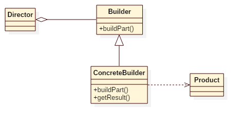

# Builder Pattern


## Intent
Separate the construction of a complex object from its representation so that
the same construction process can create different representations.


## Applicability
Use the Builder pattern when
* the algorithm for creating a complex object should be independent of the parts that make up the object and how they're assembled.
* the construction process must allow different representations for the object that's constructed.


## Structure



## Participants
* Builder
    - specifies an abstract interface for creating parts of a Product object.
* ConcreteBuilder
    - constructs and assembles parts of the product by implementing the Builder interface.
    - defines and keeps track of the representation it creates.
    - provides an interface for retrieving the product.
* Director
    - constructs an object using the Builder interface.
* Product
    - represents the complex object under construction. ConcreteBuilder builds the product's internal representation and defines the process by which it's assembled.
    - includes classes that define the constituent parts, including interfaces for assembling the parts into the final result.


## Example
Imagine you are creating a DIY car, you can select some details like engine, wheel color etc.
The process of building a car object is setting engine, wheel, color step by step.
The builder pattern allows you to create different flavors of an object while avoiding constructor pollution.

Participants in this example:
* CarBuilder is the **Builder**.
* DIYCarBuilder is the **ConcreteBuilder**.
* App is the **Director**.
* Car is the **Product**.


## Scala Tips
* Return "this" in every "buildPart" function so that you can call buildPart functions in a series:
    ```scala
     DIYCarBuilder().setEngine("V6").setWheels(4).setColor("Red")...
   ```


## Reference
* Design Patterns: Elements of Reusable Object-Oriented Software