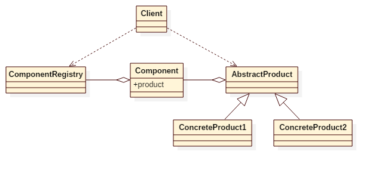

# Cake Pattern

## Intent
The Cake pattern can be considered as Scala's answer to dependency injection (DI).
The pattern separates the creation of a client's dependencies from its own behavior,
which allows program designs to be loosely coupled and to follow the inversion of control and single responsibility principles.

## Applicability
Use the Cake pattern when

* you need to remove knowledge of concrete implementation from object
* you want to enable unit testing of classes in isolation using mock objects or stubs

## Structure

## Participants
* **AbstractProduct**
    - declares an interface for a type of product object.
* **ConcreteProduct**
    - implements the AbstractProduct interface.
* **Component**
    - declares a product field for a type of AbstractProduct.
* **ComponentRegistry**
    - combines all related components into one trait for the client.
* **Client**
    - mix-in ComponentRegistry when creating a new client object.

## Example
Consider you're making a car. Different car has different components.
Audi car needs AudiBrand, V6Engine and DunlopWheel, whereas BMW car needs BMWBrand, V8Engine and MichelinWheel.
AudiCarComponentRegistry has all related components for Audi cars, while BMWCarComponentRegistry has all components for BMW cars.
To create an Audi car, just mix-in AudiCarComponentRegistry into a Car object.

Participants in this example:
* Engine, Wheel, Brand are the **AbstractProduct**.
* V6Engine/V8Engine, DunlopWheel/MichelinWheel, AudiBrand/BMWBrand are the **ConcreteProduct**.
* EngineComponent, WheelComponent, BrandComponent are the **Component**.
* AudiCarComponentRegistry, BMWCarComponentRegistry are the **ComponentRegistry**.
* Car is the **Client**.

## Scala Tips
* Cake pattern is actually an implementation of dependency injection(DI) supported by scala in language level.
To implement DI in other language(eg. Java) may request extra framework's(eg. Spring) support.

## Reference
* [cake-pattern-in-depth](https://www.cakesolutions.net/teamblogs/2011/12/19/cake-pattern-in-depth)