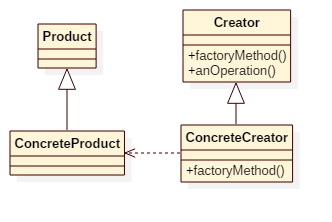

# Factory Method Pattern

## Intent
Define an interface for creating an object, but let subclasses decide which class
to instantiate. Factory Method lets a class defer instantiation to subclasses.

## Applicability
Use the Factory Method pattern when
* a class can't anticipate the class of objects it must create.
* a class wants its subclasses to specify the objects it creates.
* classes delegate responsibility to one of several helper subclasses, and you want to localize the knowledge of which helper subclass is the delegate.

## Structure

## Participants
* **Product**
    - defines the interface of objects the factory method creates.
* **ConcreteProduct**
    - implements the Product interface.
* **Creator**
    - declares the factory method, which returns an object of type Product. Creator may also define a default implementation of the factory method that returns a default ConcreteProduct object.
    - may call the factory method to create a Product object.
* **ConcreteCreator**
    - overrides the factory method to return an instance of a ConcreteProduct.

## Example
In this example, it demonstrates a chef cook noodles. As you known, all chefs
can cook, but different chef creates different flavors of noodle.

Participants in this example:
* Noodle is the **Product**.
* PadThai/Spaghetti is the **ConcreteProduct**.
* Chef is the **Creator**.
* ItalianChef/ThaiChef is the **ConcreteCreator**.

## Scala Tips
None

## Reference
* Design Patterns: Elements of Reusable Object-Oriented Software