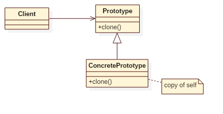

# Prototype Pattern

## Intent
Specify the kinds of objects to create using a prototypical instance, and create
new objects by copying this prototype.

## Applicability
Use the Prototype pattern when a system should be independent of how its products
are created, composed, and represented; and
* when the classes to instantiate are specified at run-time, for example, by dynamic loading; or
* to avoid building a class hierarchy of factories that parallels the class hierarchy of products; or
* when instances of a class can have one of only a few different combinations
of state. It may be more convenient to install a corresponding number of
prototypes and clone them rather than instantiating the class manually,
each time with the appropriate state.

## Structure

## Participants
* **Prototype**
    - declares an interface for cloning itself.
* **ConcretePrototype**
    - implements an operation for cloning itself.
* **Client**
    - creates a new object by asking a prototype to clone itself.

## Example
In this example, it demonstrates Virus and Bacteria clone themselves.

Participants in this example:
* Prototype is the **Prototype**.
* Bacteria/Virus is the **ConcretePrototype**.
* App is the **Client**.

## Scala Tips
* **case class** supports 'copy' operation built-in, which can clone itself, this is the easiest way to create a concrete prototype in scala.

## Reference
* Design Patterns: Elements of Reusable Object-Oriented Software
