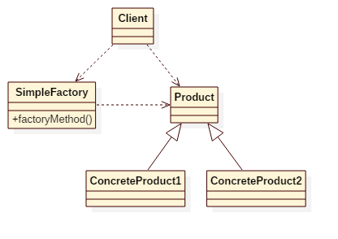

# Simple Factory Pattern

## Intent
Creates objects without exposing the instantiation logic to the client.

## Applicability
Use the Simple Factory pattern when
* you want to provide a class library of products, and you want to reveal just their interfaces, not their implementations.
* a system should be independent of how its products are created, composed, and represented.

## Structure

## Participants
* **SimpleFactory**
    - define a static factory method to create concrete product objects.
* **Product**
    - defines the interface of objects the static factory method creates.
* **ConcreteProduct**
    - implements the Product interface.
* **Client**
    - creates a new object using simple factory.

## Example
Imagine you are creating a calculator. You want to execute different operations according to operator(+,-,*,/),
which means you need create different concrete operations according to different operator.
This example demonstrates how to achieve it.

Participants in this example:
* Operation's companion object is the **SimpleFactory**, and the apply() function is the static factory method.
* Operation is the **Prodcut**.
* AddOperation/SubOperation/MulOperation/DivOperation is the **ConcreteProduct**.
* App is the **Client**.

## Scala Tips
* in scala, the **apply** function of **companion object** is the best place to implement the static factory method of simple factory.

## Reference
