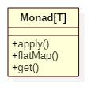

# Monad Pattern

## Intent
In functional programming, a monad is a design pattern that represents the way of chaining operations together step by step.
Binding functions can be described as passing one's output to another's input basing on the 'same type' contract.

## Applicability
Use the Monad in any of the following situations

* when you want to chain operations easily
* when you want to apply each function regardless of the result of any of them

## Structure

## Participants
* **Monad[T]**
    - create a function (e.g. apply) that takes plain type object and returns this object wrapped in a monadic value.
    - create a function (e.g. get) that return the plain type object in the monadic value.
    - create functions (e.g. flatMap, map etc) that takes a function from plain object to monadic value.

## Example
In this example, we implements a Validator monad that can validate the plain object in it.

Participants in this example:
* Validator is an abstract **Monad**.
* Valid/Illegal is the concrete class of Validator(**Monad**).

## Scala Tips
* In scala, Option/Try/Either/List are all implements of monad pattern.

## Reference
* https://en.m.wikipedia.org/wiki/Monad_(functional_programming)