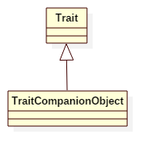

# Selfless Trait Pattern

## Intent
Allows library designers to provide services that their clients can access either through mixins or imports.
Giving users a choice between mixin composition and importing makes a library easier to use.

## Applicability
When designing a Scala library, you can partition the services offered by the library into traits. This gives your users
more flexibility: they can mix into each class only the services they need from your library. But it has some downsides.
* One downside is that name conflicts are difficult to resolve. A user can't, for example, mix together two traits that contain methods with signatures that cause an overload conflict.
* Still another downside is that it is slightly awkward to experiment with the services offered by a trait in the Scala interpreter, because before the trait's services can be accessed, it must be mixed into some class or object.

Both of these downsides can be addressed by making it easy to import the members of a trait as an alternative to mixing them in.

## Structure

## Participants
* **Trait**
    - define part of a library's behavior
* **Trait Companion Object**
    - the companion object of the trait.

## Example
Imagine we have a 'Friendly' library which provides 'greet' functionality. How can we offer users choice between mixins and imports?

Participants in this example:
* Friendly is the **Trait**.
* Friendly companion object is the **Trait Companion Object**.

## Scala Tips
* Scala has two features that make it easy to offer users this choice between mixins and imports. First, Scala allows
users to import the members of any object. Second, Scala allows traits to have a companion object---a singleton object
that has the same name as its companion trait. You implement the selfless trait pattern simply by providing a companion
object for a trait that itself mixes in the trait.

## Reference
* https://www.artima.com/scalazine/articles/selfless_trait_pattern.html