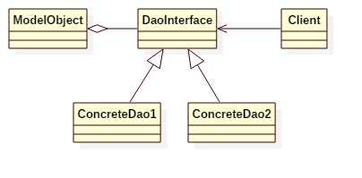

# Data Access Object Pattern

## Intent
Data Access Object Pattern or DAO pattern is used to separate low level data accessing API or operations from high level business services.
It provides an abstract interface to some type of database or other persistence mechanism.

## Applicability
Use the Data Access Object in any of the following situations

* when you want to consolidate how the data layer is accessed
* when you want to avoid writing multiple data retrieval/persistence layers

## Structure

## Participants
* **DaoInterface**
    - This interface defines the standard operations to be performed on a model object(s).
* **ConcreteDaoClass**
    - This class implements above interface. This class is responsible to get data from a data source which can be database / xml or any other storage mechanism.
* **ModelObject**
    - This object is simple POJO/Cass Class containing get/set methods to store data retrieved using DAO class.

## Example
In this example, we implements a data-access-object for save/query/update Student.

Participants in this example:
* StudentDao is the abstract **DaoInterface**.
* InMemoryStudentDao is the **ConcreteDaoClass**.
* Student is the **ModelObject**.

## Scala Tips
None

## Reference
https://www.tutorialspoint.com/design_pattern/data_access_object_pattern.htm