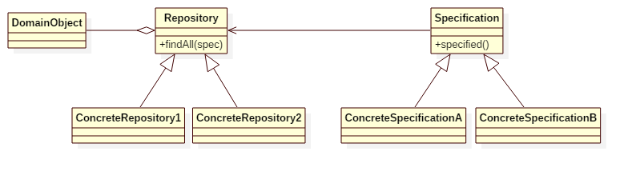

# Repository Pattern

## Intent
Repository layer is added between the domain and data mapping layers to isolate domain objects from details of 
the database access code and to minimize scattering and duplication of query code.

Comparing with DAO pattern, the repository pattern uses a metaphor of a Collection. 
This metaphor gives the pattern a tight contract and make it easier to understand.

## Applicability
Use the Repository pattern when

* the number of domain objects is large
* you want to avoid duplication of query code
* you want to keep the database querying code in single place
* you have multiple data sources 

## Structure

## Participants
* **Repository**
    - This interface defines the standard operations of a repository.
* **ConcreteRepository**
    - This class implements above interface. This class is responsible to get data from a data source which can be database / memory or any other storage mechanism.
* **Specification**
    - This interface defines operations that is able to tell if a candidate object matches some criteria.
* **ConcreteSpecification**
    - It provides different kind of specifications.
* **DomainObject**
    - It is the domain object which is managed by the repository.

## Example
In this example, we implements a repository for save/find/delete Account. We can find the Account in different ways, 
e.g. "age between a and b" or "name = xxx".

Participants in this example:
* AccountRepository is the abstract **Repository**.
* AccountRepositoryInMemory/AccountRepositoryInDatabase is the **ConcreteRepository**.
* AccountSpecification is the abstract **Specification**.
* AgeBetweenSpec/NameEqualSpec is the **ConcreteSpecification**.
* Account is the **DomainObject**.

## Scala Tips
None

## Reference
https://thinkinginobjects.com/2012/08/26/dont-use-dao-use-repository/