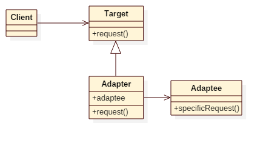

# Adapter Pattern

## Intent
Convert the interface of a class into another interface clients expect. Adapter
lets classes work together that couldn't otherwise because of incompatible interfaces.

## Applicability
Use the Adapter pattern when
* you want to use an existing class, and its interface does not match the one you need.
* you want to create a reusable class that cooperates with unrelated or
unforeseen classes, that is, classes that don't necessarily have compatible interfaces.
* (object adapter only) you need to use several existing subclasses, but it's
impractical to adapt their interface by subclassing every one. An object
adapter can adapt the interface of its parent class.

## Structure

## Participants
* Target
    - defines the domain-specific interface that Client uses.
* Client
    - collaborates with objects conforming to the Target interface.
* Adaptee
    - defines an existing interface that needs adapting.
* Adapter
    - adapts the interface of Adaptee to the Target interface.

## Example
Imagine soldiers can fight with weapons, but knife is not a sub-class of Weapon.
What should we do? We can make a adapter for knife so that soldiers can use it as using a weapon.

Participants in this example:
* Weapon(Ak47) is the **Target**.
* Knife is the **Adaptee**.
* Soldier is the **Client**.
* implicit Knife2WeaponAdapter is the **Adapter**.

## Scala Tips
* In Scala, we have a built-in concept of interface adapters, expressed as **implicit classes**.

## Reference
* Design Patterns: Elements of Reusable Object-Oriented Software