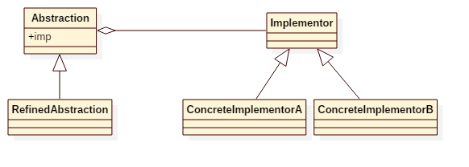

# Bridge Pattern

## Intent
Decouple an abstraction from its implementation so that the two can vary independently.


## Applicability
Use the Bridge pattern when
* you want to avoid a permanent binding between an abstraction and its implementation. This might be the case, for example, when the implementation must be selected or switched at run-time.
* both the abstractions and their implementations should be extensible by subclassing. In this case, the Bridge pattern lets you combine the different abstractions and implementations and extend them independently.
* changes in the implementation of an abstraction should have no impact on clients; that is, their code should not have to be recompiled.
* you have a proliferation of classes as shown earlier in the first Motivation diagram. Such a class hierarchy indicates the need for splitting an object into two parts. Rumbaugh uses the term "nested generalizations" to refer to such class hierarchies.
* you want to share an implementation among multiple objects (perhaps using reference counting), and this fact should be hidden from the client. A simple example is Coplien's String class, in which multiple objects can share the same string representation.


## Structure



## Participants
* **Abstraction**
    - defines the abstraction's interface.
    - maintains a reference to an object of type Implementor.
* **RefinedAbstraction**
    - Extends the interface defined by Abstraction.
* **Implementor**
    - defines the interface for implementation classes. This interface doesn't have to correspond exactly to Abstraction's interface; in fact the two interfaces can be quite different. Typically the Implementor interface provides only primitive operations, and Abstraction defines higher-level operations based on these primitives.
* **ConcreteImplementor**
    -implements the Implementor interface and defines its concrete implementation.


## Example
We have a website. It contains several web pages, like about page, help page, etc. And for the entire website, we have
2 different themes, which are dark and light. How can we make the change of theme easier?

Participants in this example:
* WebPage is the **Abstraction**.
* AboutPage/HelpPage is the **RefinedAbstraction**.
* Theme is the **Implementor**.
* DarkTheme/LightTheme is the **ConcreteImplementor**.


## Scala Tips
* You can also implement bridge pattern by using *implicit parameter* in scala, for example:
    ```scala
    abstract class WebPage {
      def getContent(implicit theme: Theme): String
    }

    class AboutPage extends WebPage {
      override def getContent(implicit theme: Theme): String = "About page in " + theme.getColor
    }

    // in client
    implicit var theme = new DarkTheme
    new AboutPage().getContent

    ```


## Reference
* Design Patterns: Elements of Reusable Object-Oriented Software