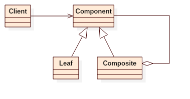

# Composite Pattern


## Intent
Compose objects into tree structures to represent part-whole hierarchies.
Composite lets clients treat individual objects and compositions of objects uniformly.


## Applicability
Use the Composite pattern when
* you want to represent part-whole hierarchies of objects.
* you want clients to be able to ignore the difference between compositions of objects and individual objects.
Clients will treat all objects in the composite structure uniformly.


## Structure



## Participants
* **Component**
    - declares the interface for objects in the composition.
    - implements default behavior for the interface common to all classes, as appropriate.
    - declares an interface for accessing and managing its child components.
    - (optional) defines an interface for accessing a component's parent in the recursive structure, and implements it if that's appropriate.
* **Leaf**
    - represents leaf objects in the composition. A leaf has no children.
    - defines behavior for primitive objects in the composition.
* **Composite**
    - defines behavior for components having children.
    - stores child components.
    - implements child-related operations in the Component interface.
* **Client**
    - manipulates objects in the composition through the Component interface.


## Example
We have several concrete action, like Forward, TurnLeft, TurnRight, etc.
The composition of these actions is also a action.

Participants in this example:
* Action is the **Component**.
* Forward/TurnLeft/TurnRight is the **Leaf**.
* CompositeAction is the **Composite**.
* App is the **Client**.


## Scala Tips
* Scala allows you to pass variable length arguments to the function, for example:
     ```scala
     class CompositeAction(actions: Action*)
     ```


## Reference
* Design Patterns: Elements of Reusable Object-Oriented Software