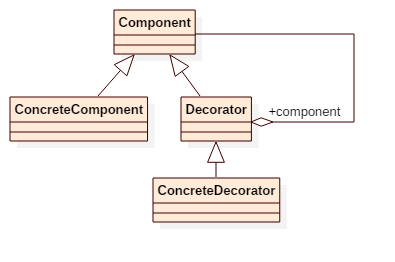

# Decorator Pattern

## Intent
Attach additional responsibilities to an object dynamically. Decorators provide
a flexible alternative to subclassing for extending functionality.

## Applicability
Use Decorator
* to add responsibilities to individual objects dynamically and transparently, that is, without affecting other objects.
* for responsibilities that can be withdrawn.
* when extension by subclassing is impractical. Sometimes a large number of independent extensions are possible and would produce an explosion of
subclasses to support every combination. Or a class definition may be hidden or otherwise unavailable for subclassing.

## Structure

## Participants
* **Component**
    - defines the interface for objects that can have responsibilities added to them dynamically.
* **ConcreteComponent**
    - defines an object to which additional responsibilities can be attached.
* **Decorator**
    - maintains a reference to a Component object and defines an interface that conforms to Component's interface.
* **ConcreteDecorator**
    - adds responsibilities to the component.

## Example
Imagine you are selling coffee. Simple coffee costs $5, while adding milk or sugar costs more money. The milk and sugar
are the decorators of coffee object, which made the cost(functionality) different.

Participants in this example:
* Coffee is the **Component**.
* SimpleCoffee is the **ConcreteComponent**.
* MilkAdded/SugarAdded trait is the **Decorator**, as well as the **ConcreteDecorator**.

## Scala Tips
* Scala provides a direct way of overriding interface methods, without binding to their concrete implementation in place of declaration.
In Scala, such a use of traits is known as [Stackable Trait Pattern](http://www.artima.com/scalazine/articles/stackable_trait_pattern.html).

## Reference
* Design Patterns: Elements of Reusable Object-Oriented Software
* https://pavelfatin.com/design-patterns-in-scala/