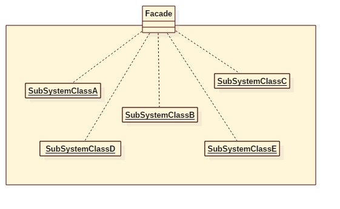

# Facade Pattern

## Intent
Provide a unified interface to a set of interfaces in a subsystem. Facade defines
a higher-level interface that makes the subsystem easier to use.

## Applicability
Use the Facade pattern when
* you want to provide a simple interface to a complex subsystem. Subsystems
often get more complex as they evolve. Most patterns, when applied, result
in more and smaller classes. This makes the subsystem more reusable and
easier to customize, but it also becomes harder to use for clients that
don't need to customize it. A facade can provide a simple default view of
the subsystem that is good enough for most clients. Only clients needing
more customizability will need to look beyond the facade.
* there are many dependencies between clients and the implementation classes
of an abstraction. Introduce a facade to decouple the subsystem from clients
and other subsystems, thereby promoting subsystem independence and
portability.
* you want to layer your subsystems. Use a facade to define an entry point
to each subsystem level. If subsystems are dependent, then you can simplify
the dependencies between them by making them communicate with each other
solely through their facades.

## Structure

## Participants
* **Facade**
    - knows which subsystem classes are responsible for a request.
    - delegates client requests to appropriate subsystem objects.
* **subsystem classes**
    - implement subsystem functionality.
    - handle work assigned by the Facade object.
    - have no knowledge of the facade; that is, they keep no references to it.

## Example
Imagine we have a computer system. There are a lot of components in the system, like cpu, fan, light, etc.
As you know, the computer provides a simple interface to power on it. But actually, while pressing the power on button,
it does a lot of work, such as power on cpu, fan and flash the light...

Participants in this example:
* ComputerFacade is the **Facade**.
* CPU/Fan/Light is the **subsystem classes**.

## Scala Tips
None

## Reference
* Design Patterns: Elements of Reusable Object-Oriented Software