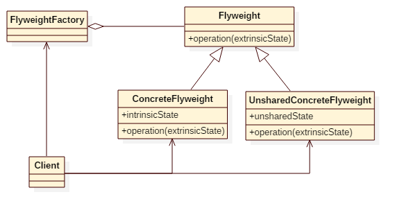

# Flyweight Pattern

## Intent
Use sharing to support large numbers of fine-grained objects efficiently.

## Applicability
The Flyweight pattern's effectiveness depends heavily on how and where it's used. Apply the Flyweight pattern when all of the following are true:
* An application uses a large number of objects.
* Storage costs are high because of the sheer quantity of objects.
* Most object state can be made extrinsic.
* Many groups of objects may be replaced by relatively few shared objects once extrinsic state is removed.
* The application doesn't depend on object identity. Since flyweight objects may be shared, identity tests will return true for conceptually distinct objects.

## Structure

## Participants
* **Flyweight**
    - declares an interface through which flyweights can receive and act on extrinsic state.
* **ConcreteFlyweight**
    - implements the Flyweight interface and adds storage for intrinsic
    state, if any. A ConcreteFlyweight object must be sharable. Any state
    it stores must be intrinsic; that is, it must be independent of the
    ConcreteFlyweight object's context.
* **UnsharedConcreteFlyweight**
    - not all Flyweight subclasses need to be shared. The Flyweight
    interface enables sharing; it doesn't enforce it. It's common for
    UnsharedConcreteFlyweight objects to have ConcreteFlyweight
    objects as children at some level in the flyweight object structure.
* **FlyweightFactory**
    - creates and manages flyweight objects.
    - ensures that flyweights are shared properly. When a client requests
    a flyweight, the FlyweightFactory object supplies an existing
    instance or creates one, if none exists.
* **Client**
    - maintains a reference to flyweight(s).
    - computes or stores the extrinsic state of flyweight(s).

## Example
There is a tea shop which makes tea for customers. It is more economical that the tea shop makes a big pot of green tea
and serve several customers than make a cup of green tea for each customer. But for some VIP customers, they want some
unshared tea, the tea shop must provide this kind of service too.

Participants in this example:
* Tea is the **Flyweight**.
* GreenTea is the **ConcreteFlyweight**.
* UnsharedTea is the **UnsharedConcreteFlyweight**.
* TeaMaker is the **FlyweightFactory**.
* TeaShop is the **Client**.

## Scala Tips
None

## Reference
* Design Patterns: Elements of Reusable Object-Oriented Software