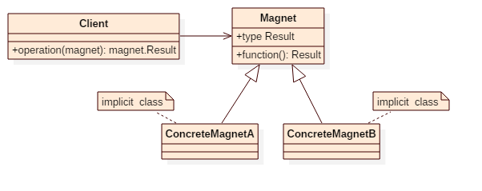

# Magnet Pattern

## Intent
The magnet pattern is an alternative approach to method overloading.


## Applicability
method overloading in Scala comes with (at least) the following problems and inconveniences:

1. "Collisions" caused by type erasure
2. No lifting into a function (of all overloads at the same time)
3. Unavailability in package objects (before Scala 2.10)
4. Code duplication in case of many similar overloads

The magnet pattern can solve these issues


## Structure



## Participants
* **Magnet**
    - declare a magnet interface.
    - declare a abstract type for result.
* **ConcreteMagnet**
    - implement Magnet interface.
    - declare it as implicit class
* **Client**
    - define a function which take a magnet object as argument and return the type of magnet.Result


## Example
Overload ```double``` function so that it can process Int, List[Int], List[String] and Tuple2[String, Int]

Participants in this example:
* DoubleMagnet is the **Magnet**.
* fromInt/fromListInt/fromListString/fromStringIntTuple is the implicit class of **ConcreteMagnet**.
* Doubling is the **Client**.


## Scala Tips
* Magnet pattern is a way of using type-classes pattern for method overloading purpose.


## Reference
http://spray.io/blog/2012-12-13-the-magnet-pattern/