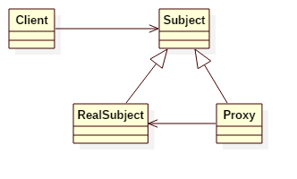

# Proxy Pattern

## Intent
Provide a surrogate or placeholder for another object to control access to it.

## Applicability
Proxy is applicable whenever there is a need for a more versatile or sophisticated
reference to an object than a simple pointer. Here are several common situations
in which the Proxy pattern is applicable:
1. A remote proxy provides a local representative for an object in a different address space.
2. A virtual proxy creates expensive objects on demand.
3. A protection proxy controls access to the original object. Protection proxies are useful when objects should have different access rights.
4. A smart reference is a replacement for a bare pointer that performs additional actions when an object is accessed. Typical uses include
    - counting the number of references to the real object so that it can be freed automatically when there are no more references.
    - loading a persistent object into memory when it's first referenced.
    - checking that the real object is locked before it's accessed to ensure that no other object can change it.

## Structure

## Participants
* **Proxy**
    - maintains a reference that lets the proxy access the real subject. Proxy may refer to a Subject if the RealSubject and Subject interfaces are the same.
    - provides an interface identical to Subject's so that a proxy can by substituted for the real subject.
    - controls access to the real subject and may be responsible for creating and deleting it.
    - other responsibilities depend on the kind of proxy:
        - remote proxies are responsible for encoding a request and its arguments and for sending the encoded request to the real subject in a different address space.
        - virtual proxies may cache additional information about the real subject so that they can postpone accessing it. For example, the ImageProxy from the Motivation caches the real image's extent.
        - protection proxies check that the caller has the access permissions required to perform a request.
* **Subject**
    - defines the common interface for RealSubject and Proxy so that a Proxy can be used anywhere a RealSubject is expected.
* **RealSubject**
    - defines the real object that the proxy represents.

## Example
There is a computer running linux. We can SSH to the computer and feel like we are operating the real computer. SSH is the proxy.

Participants in this example:
* Computer is the **Subject**.
* LinuxComputer is the **RealSubject**.
* SecurityShell is the **Proxy**.

## Scala Tips
None

## Reference
* Design Patterns: Elements of Reusable Object-Oriented Software