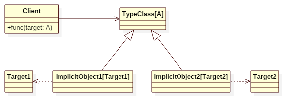

# Type Classes Pattern


## Intent
In computer science, a type class is a type system construct that supports ad hoc polymorphism.
The type classes pattern supports retroactive extension: the ability to extend existing software modules with new functionality without needing to touch or re-compile the original source.


## Applicability
Use type-classes pattern when
* you want to ad-hoc and retroactive polymorphism
* avoiding using a lot of adapters


## Structure



## Participants
* **TypeClass**
    - always takes one or more type parameters.
    - is usually designed to be stateless.
* **ImplicitObject**
    - is the implicit value/object converting ```Target``` to ```TypeClass[Target]```.
* **Target**
    - defines the real object that used in client's function as a parameter.
* **Client**
    - defines functions which take parameter ```T``` and implicit parameter ```TypeClass[T]```.


## Example
Imagine a human can say hello to some targets, but he has no idea what are concrete types of the targets.
He only knows that the targets are Speakable. This example demonstrates how to make this happen.

Participants in this example:
* Speakable is the **TypeClass**.
* SpeakableMonkey/SpeakableLion is the **ImplicitObject**.
* Monkey/Lion is the **Target**.
* Human is the **Client***.


## Scala Tips
* As a shortcut for implicit parameters with only one type parameter, Scala provides so-called context bounds. For example:
    ```scala
    def sayHelloTo[A: Speakable[A]](target: A): String = {
      s"Human say hello, get reply ${implicitly[Speakable[A]].say()}"
    }
    ```
    If you want to access that implicitly available value, you need to call the ```implicitly``` method.


## Reference
http://danielwestheide.com/blog/2013/02/06/the-neophytes-guide-to-scala-part-12-type-classes.html